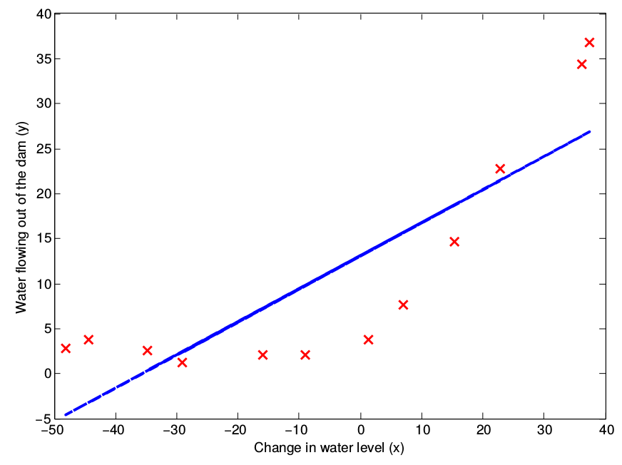
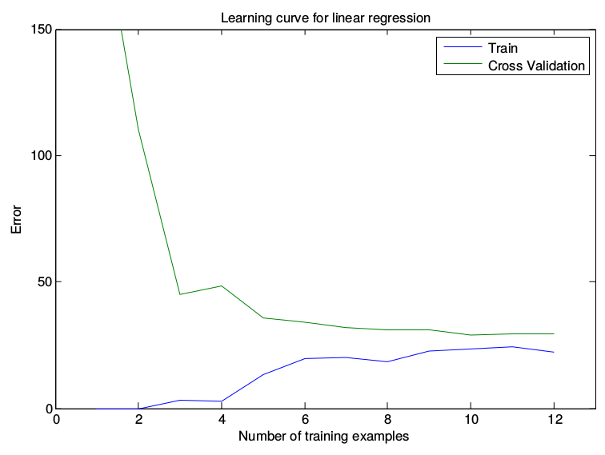
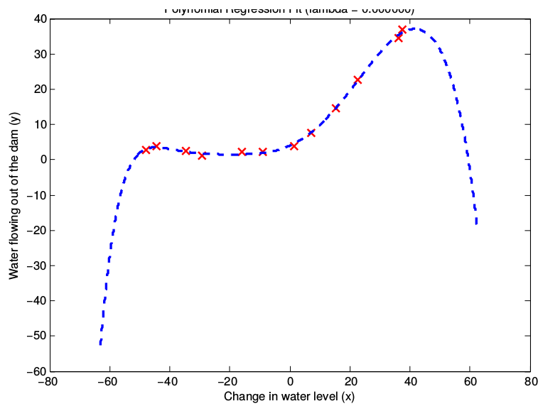
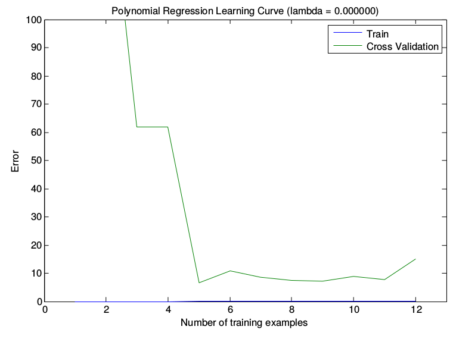

# Diagnostic

>nn老是gg，怎么办？

[TOC]

## Definition

- Training set: $60\%$ 
- Cross Validation set: $20\%$
- Test set: $20\%$

交叉验证和测试集不能有相同样本，参数好坏根据CV选，Test**只能用来测试!!!**

- Bias: Underfit, $\lambda$过大，没充分利用数据
- Variance: Overfit, $\lambda$过小
- Learning curves: 在Training set中取前$m$个样本训练，当$m$变化的时候，$J_{\text{train}}(\theta)$和$J_{\text{CV}}(\theta)$的变化曲线
  - High Bias: High error, 曲线靠的紧，已经收敛——弄再多的数据也没用
  - High Variance: 有Gap，仍未收敛，可以多弄点数据

## Selecting $\lambda$ using a cross validation set

## High Bias

1. Try getting additional features
2. Try adding polynomial features ($x_1^2,x_2^2,x_1x_2, \cdots$)
3. Try decreasing $\lambda$

## High Variance

1. Get more training examples
2. Try smaller sets of features
3. Try increasing $\lambda$

## $F_1$ score

| Predict \ Actual | 1              | 0              |
| ---------------- | -------------- | -------------- |
| 1                | True Positive  | False Positive |
| 0                | False Negative | True Negative  |

- $y=1$ in presence of rare class that we want to detect
- **Precision:** $\displaystyle P=\frac{TP}{TP+FP}$ 横着的
- **recall:** $\displaystyle R=\frac{TP}{TP+FN}$ 竖着的
- **$F_1$ Score: ** $\displaystyle F_1=\frac{2PR}{P+R}$

Predict 1 if $h_\theta(x)\ge $ threshold

## Recommended approach

1. Start with a simple algorithm that you can implement quickly. Implement it and test it on your cross-validation data.

2. Plot learning curves to decide if more data, more features, etc. are likely to help.

3. Error analysis:  Manually examine the examples (in cross-validation set) that your algorithm made errors on. See if you spot any systematic trend in what type of examples it is making errors on.

