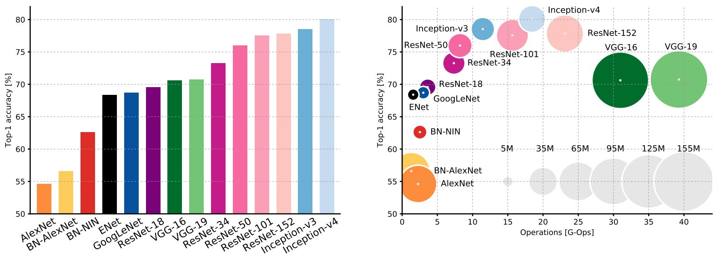
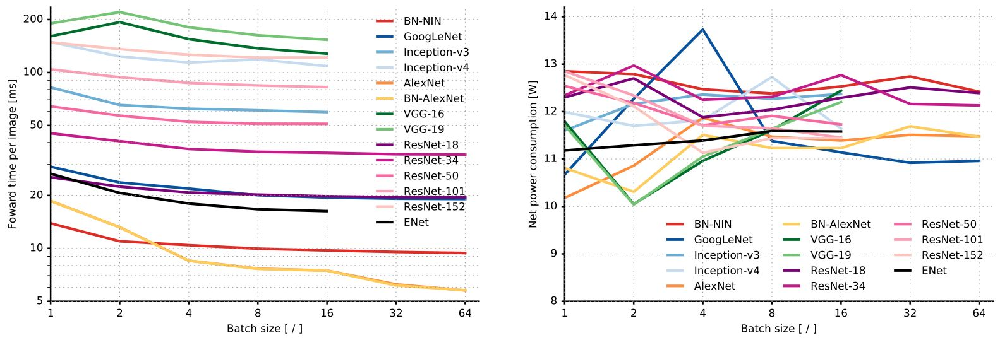

# Neural Networks

> 全都是Noise
>
> 全都是Nearest Neighbors
>
> 全都是玄学

[TOC]


Typical architectures look like:

[(CONV-RELU)\*N-POOL?]\*M-(FC-RELU)\*K,SOFTMAX

where N is usually up to ~5, M is large, 0 <= K <= 2.

- but recent advances such as ResNet/GoogLeNet challenge this paradigm

## Random initialization

Use Xavier initialization: 假设数据服从高斯分布，保持运算前后方差不变。具体：

When training neural networks, it is important to randomly initialize the parameters for symmetry breaking. One effective strategy for random initialization is to randomly select values for $\Theta^{(l)}$ uniformly in the range $[-\epsilon_{init}, \epsilon_{init} ]$. This range of values ensures that the parameters are kept small and makes the learning more efficient.

One effective strategy for choosing $\epsilon_{init}$ is to base it on the number of units in the network. A good choice of $\epsilon_{init}$ is $\epsilon_{init} = \frac{\sqrt{6}}{\sqrt{L_{in}+L_{out}}}$, where $L_{in} = s_l$ and $L_{out} = s_{l+1}$ are in out the number of units in the layers adjacent to $\Theta^{(l)}$.

## Cost Function

$$
J(\Theta)=-\frac{1}{m}\Big[\sum_{i=1}^m\sum_{k=1}^Ky^{(i)}\log h_\theta(x^{(i)})+(1-y^{(i)})\log (1-h_\theta(x^{(i)})) \Big]+\frac{\lambda}{2m}\sum_{l=1}^{L-1}\sum_{i=1}^{s_l}\sum_{j=1}^{s_{l+1}}(\theta_{ji}^{(l)})^2
$$

## Gradient Descent

见`machine-learning-ex4/ex4.pdf` Page 9

## Vectorization

```matlab
% see machine-learning-ex4/ex4/nnCostFunction.m
```

## Activation Functions

### Sigmoid

$\displaystyle\sigma(x)=\frac{1}{1+e^{-x}}$

- [x] Squashes numbers to range [0,1]


- [x] Historically popular since they have nice interpretation as a saturating “firing rate” of a neuron
- [ ] Saturated neurons “kill” the gradients
- [ ] Sigmoid outputs are not zero-centered
- [ ] exp() is a bit compute expensive

### tanh

$\tanh(x)$

- [x] Squashes numbers to range [-1,1]
- [x] zero centered (nice)
- [ ] still kills gradients when saturated :(

### ReLU

$\max(0,x)$

- [x] Does not saturate (in +region)

- [x] Very computationally efficient

- [x] Converges much faster than sigmoid/tanh in practice (e.g. 6x)

- [x] Actually more biologically plausible than sigmoid

- [ ] Not zero-centered output

- [ ] dead ReLU will never activate => never update

      => people like to initialize ReLU neurons with slightly positive biases (e.g. 0.01)

### Leaky ReLU

$\max(0.1x,x)$

- [x] Does not saturate
- [x] Computationally efficient
- [x] Converges much faster than sigmoid/tanh in practice! (e.g. 6x)
- [x] will not “die”.

Parametric Rectifier (PReLU): $f(x)= \max(\alpha x,x)$

### Maxout

$\max(w_1^Tx+b_1,w_2^Tx+b_2)$

- [x] Does not have the basic form of dot product -> nonlinearity
- [x] Generalizes ReLU and Leaky ReLU
- [x] Linear Regime! Does not saturate! Does not die!
- [ ] doubles the number of parameters/neuron :(

### ELU

$[x\ge 0]x+[x<0]\alpha(e^x-1)$

- [x] All benefits of ReLU
- [x] Closer to zero mean outputs
- [x] Negative saturation regime compared with Leaky ReLU adds some robustness to noise
- [ ] Computation requires exp()

### In practice

- Use ReLU. Be careful with your learning rates
- Try out Leaky ReLU / Maxout / ELU
- Try out tanh but don’t expect much
- Don’t use sigmoid

## Batch Normalization

- $\displaystyle\mu_B\leftarrow\frac{1}{m}\sum_{i=1}^m x_i$ //mini-batch mean
- $\displaystyle\sigma_B^2\leftarrow\frac{1}{m}\sum_{i=1}^m(x_i-\mu_B)^2$ // mini-batch varience
- $\displaystyle \hat{x_i}\leftarrow \frac{x_i-\mu_B}{\sqrt{\sigma_B^2+\epsilon}}$ // normalize
- $\displaystyle y_i\leftarrow \gamma\hat{x_i}+\beta\equiv \texttt{BN}_{\gamma,\beta}(x_i)$ //scale and shift

- [x] Improves gradient flow through the network
- [x] Allows higher learning rates
- [x] Reduces the strong dependence on initialization
- [x] Acts as a form of regularization in a funny way, and slightly reduces the need for dropout, maybe

## Transfer learning

https://github.com/pytorch/vision

fine tune 最后一层

## CNN Architectures

### AlexNet

Full (simplified) AlexNet architecture:
[227x227x3] INPUT
[55x55x96] CONV1: 96 11x11 filters at stride 4, pad 0
[27x27x96] MAX POOL1: 3x3 filters at stride 2
[27x27x96] NORM1: Normalization layer
[27x27x256] CONV2: 256 5x5 filters at stride 1, pad 2
[13x13x256] MAX POOL2: 3x3 filters at stride 2
[13x13x256] NORM2: Normalization layer
[13x13x384] CONV3: 384 3x3 filters at stride 1, pad 1
[13x13x384] CONV4: 384 3x3 filters at stride 1, pad 1
[13x13x256] CONV5: 256 3x3 filters at stride 1, pad 1
[6x6x256] MAX POOL3: 3x3 filters at stride 2
[4096] FC6: 4096 neurons
[4096] FC7: 4096 neurons
[1000] FC8: 1000 neurons (class scores)

Details/Retrospectives:

- first use of ReLU
- used Norm layers (not common anymore)
- heavy data augmentation
- dropout 0.5
- batch size 128
- SGD Momentum 0.9
- Learning rate 1e-2, reduced by 10
  manually when val accuracy plateaus
- L2 weight decay 5e-4
- 7 CNN ensemble: 18.2% -> 15.4%

### VGG16

INPUT: [224x224x3]
memory: 224*224*3=150K params: 0
CONV3-64: [224x224x64] memory: 224*224*64=3.2M params: (3*3*3)*64 = 1,728
CONV3-64: [224x224x64] memory: 224*224*64=3.2M params: (3*3*64)*64 = 36,864  // Most memory is in early CONV
POOL2: [112x112x64] memory: 112*112*64=800K params: 0
CONV3-128: [112x112x128] memory: 112*112*128=1.6M params: (3*3*64)*128 = 73,728
CONV3-128: [112x112x128] memory: 112*112*128=1.6M params: (3*3*128)*128 = 147,456
POOL2: [56x56x128] memory: 56*56*128=400K params: 0
CONV3-256: [56x56x256] memory: 56*56*256=800K params: (3*3*128)*256 = 294,912
CONV3-256: [56x56x256] memory: 56*56*256=800K params: (3*3*256)*256 = 589,824
CONV3-256: [56x56x256] memory: 56*56*256=800K params: (3*3*256)*256 = 589,824
POOL2: [28x28x256] memory: 28*28*256=200K params: 0
CONV3-512: [28x28x512] memory: 28*28*512=400K params: (3*3*256)*512 = 1,179,648
CONV3-512: [28x28x512] memory: 28*28*512=400K params: (3*3*512)*512 = 2,359,296
CONV3-512: [28x28x512] memory: 28*28*512=400K params: (3*3*512)*512 = 2,359,296
POOL2: [14x14x512] memory: 14*14*512=100K params: 0
CONV3-512: [14x14x512] memory: 14*14*512=100K params: (3*3*512)*512 = 2,359,296
CONV3-512: [14x14x512] memory: 14*14*512=100K params: (3*3*512)*512 = 2,359,296
CONV3-512: [14x14x512] memory: 14*14*512=100K params: (3*3*512)*512 = 2,359,296
POOL2: [7x7x512] memory: 7*7*512=25K params: 0
FC: [1x1x4096] memory: 4096 params: 7*7*512*4096 = 102,760,448  // Most params are in late FC
FC: [1x1x4096] memory: 4096 params: 4096*4096 = 16,777,216
FC: [1x1x1000] memory: 1000 params: 4096*1000 = 4,096,000

TOTAL memory: 24M * 4 bytes ~= 96MB / image (only forward! ~*2 for bwd)
TOTAL params: 138M parameters

Details:

- ILSVRC’14 2nd in classification, 1st in localization
- Similar training procedure as Krizhevsky 2012
- No Local Response Normalisation (LRN)
- Use VGG16 or VGG19 (VGG19 only slightly better, more memory)
- Use ensembles for best results 
- FC7 features generalize well to other tasks

### GoogLeNet

Deeper networks, with computational efficiency

- 22 layers
- Efficient “Inception” module
- No FC layers
- Only 5 million parameters!
- 12x less than AlexNet
- ILSVRC’14 classification winner (6.7% top 5 error)

Inception module

Conv Ops:
[1x1 conv, 64] 28x28x64x1x1x256
[1x1 conv, 64] 28x28x64x1x1x256
[1x1 conv, 128] 28x28x128x1x1x256
[3x3 conv, 192] 28x28x192x3x3x64
[5x5 conv, 96] 28x28x96x5x5x64
[1x1 conv, 64] 28x28x64x1x1x256
Total: 358M ops
Compared to 854M ops for naive version
Bottleneck can also reduce depth after pooling layer

### ResNet

Very deep networks using residual connections

- 152-layer model for ImageNet
- ILSVRC’15 classification winner (3.57% top 5 error)
- Swept all classification and detection competitions in ILSVRC’15 and COCO’15!

Use layers to fit residual F(x) = H(x) - x instead of H(x) directly

Training ResNet in practice:

- Batch Normalization after every CONV layer
- Xavier/2 initialization from He et al.
- SGD + Momentum (0.9)
- Learning rate: 0.1, divided by 10 when validation error plateaus
- Mini-batch size 256
- Weight decay of 1e-5
- No dropout used





## RNN & LSTM

**Vanilla RNN**
$$
h_t=\tanh\Bigg(W{h_{t-1}\choose x_t}\Bigg)
$$
**LSTM**
$$
\begin{pmatrix}i\\f\\o\\g\end{pmatrix}=\begin{pmatrix}\sigma\\\sigma\\\sigma\\\tanh\end{pmatrix}W{h_{t-1}\choose x_t}
$$

$$
c_t=f\odot c_{t-1}+i\odot g
$$

$$
h_t=o\odot\tanh(c_t)
$$

f: forget gate, whether to erase cell

i: input gate, whether to write to cell

g: gate gate, how much to write to cell

o: output gate, how much to reveal cell

**GRU**
$$
r_t=\sigma(W_{xr}x_t+W_{hr}h_{t-1}+b_r)
$$

$$
z_t=\sigma(W_{xz}x_t+W_{hz}h_{t-1}+b_z)
$$

$$
\tilde{h_t}=\tanh(W_{xh}x_t+W_{hh}(r_t\odot h_{t-1})+b_h)
$$

$$
h_t=z_t\odot h_{t-1}+(1-z_t)\odot \tilde{h_t}
$$

