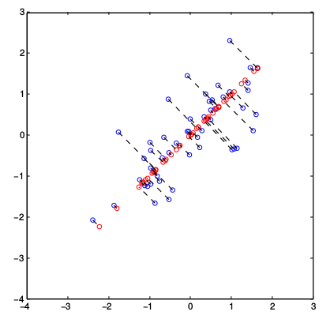

# PCA

[TOC]

## Algorithm

1. feature normalize

2. compute the covariance matrix of the data
   $$
   \Sigma=\frac{1}{m}X^TX
   $$
   where $X$ is the data matrix with examples in rows, and m is the number of examples. Note that $\Sigma$ is a $n \times n$ matrix and not the summation operator.

3. run SVD on it to compute the principal components: `[U,S,V]=svd(Sigma);`

4. project data: `Z=X*U(:,1:K);`

5. reconstruct data: `X_rec=Z*U(:,1:K)';`

## Choosing number of principal components

$$
\frac{\sum_{i=1}^m||x^{(i)}-x_{approx}^{(i)}||^2}{\sum_{i=1}^m||x^{(i)}||^2}\le0.01
$$

means 99% of variance is retained. Equivalent to
$$
\frac{\sum_{i=1}^kS_{ii}}{\sum_{i=1}^nS_{ii}}\ge 0.99
$$

## Performance

**Bad use of PCA: To prevent overfitting**

*This might work OK, but isn’t a good way to address overfitting. Use regularization instead.*