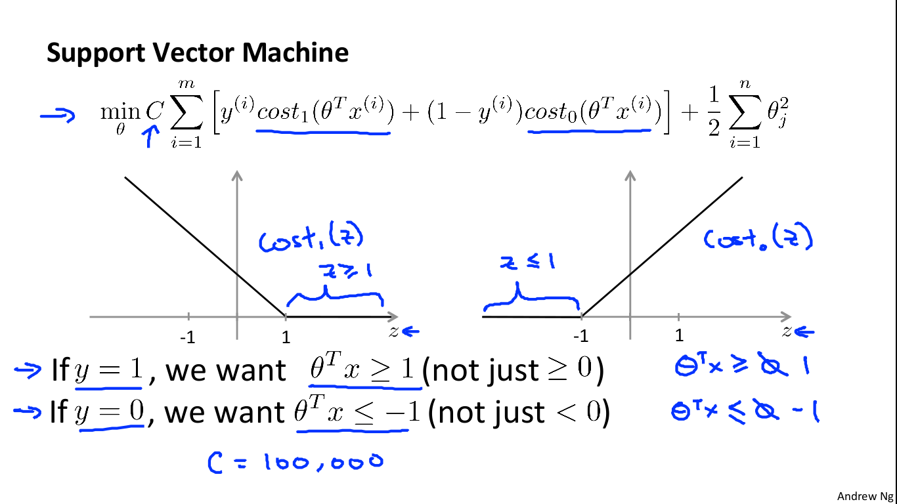

# SVM

> “数学之美，巅峰之作”
>
> 但是Ng讲了跟没讲一样……
>
> TODO

[TOC]

## Problem Formulation

- $C=\frac{1}{\lambda}$
- 下面两行是约束条件

## Kernel

### Linear Kernel

= No kernel

### Gaussian kernel

$$
f=\text{K}(x,l)=\exp(-\frac{||x-l||^2}{2\sigma^2})
$$

范围在$[0,1]$之间，越相似就越趋近1

- Large $\sigma^2$: Features $f_i$ vary more smoothly. Higher bias, lower variance.
- Small $\sigma^2$: Features $f_i$ vary less smoothly. Lower bias, higher variance.	

$C$和$\sigma^2$的选取产生的不同情况见`machine-learning-ex6/ex6/*.png`

### Polynomial kernel

$$
f=\text{K}(x,l)=(x^Tl+c)^p
$$

### Other kernel

String kernel, chi-square kernel, histogram intersection kernel, ...